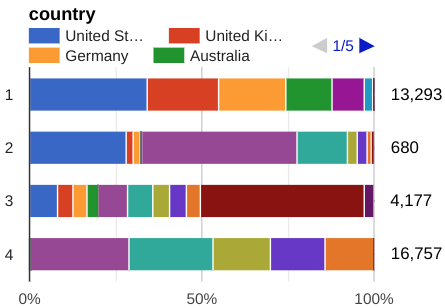

# Using Bigquery ML for Advertising
This project provides a Terraform deployment to create a new Google Cloud project that hosts a copy of the `thelook_ecommerce` [public dataset](https://console.cloud.google.com/marketplace/product/bigquery-public-data/thelook-ecommerce) and applies different [Bigquery Machine Learning](https://cloud.google.com/bigquery/docs/bqml-introduction) technics for advertising purposes.

**Disclaimer** : This is not supported code by Google and is provided as is, without warranties of any kind.

This terraform deployment uses the `thelook_ecommerce` dataset to do the following :
- **Generate a product description** based on the product Brand, Name and Category using GenAI
- **Create segments** on sales per brand, product categories and location
- **Recommend products** based on the previous purchases and most sold products

For those three use cases, we employ three ML algorithms that are common in the industry and that are provided as a service within Google Cloud bigquery :
- **Generative AI** using the `text-bison` LLM from Google. This has various applications for campaigns automation, creative optimization, personalization, localization, sentiment analysis, and other use cases.
- **K-means for clustering**. This is used for very various cases in the industry from products classification, building cohorts, customer segments, recommendation, personalization, targeting,...
- **Matrix Factorization** is a common technique for recommendation systems, behavior analysis, cross selling, A/B B testing, dimensional reduction and many more.

## Architecture Design

We will be choosing our training models as per the recommended [Selection guide](https://cloud.google.com/bigquery/docs/bqml-introduction#model_selection_guide) proposed by Google Cloud
<p align="center">

</p>

## Components
This project mainly relies on Google Cloud [BigQuery](https://cloud.google.com/bigquery/docs/introduction). It uses a copy of `bigquery-public-data.thelook_ecommerce` locally in the newly created project to host views and models.

We also use [Vertex AI](https://cloud.google.com/bigquery/docs/reference/standard-sql/bigqueryml-syntax-create-remote-model) for Generative AI and use the `text-bison` remote model as an LLM to generate article descriptions.

## Setup

### Prerequisites
You will need to have a working installation of [terraform](https://developer.hashicorp.com/terraform/install). The working version at the time writing this deployment is [Version 1.6.6](https://releases.hashicorp.com/terraform/1.6.6/terraform_1.6.6_linux_amd64.zip). Upon initialization, the latest Terraform Google Cloud Provider will be downloaded (currently v5.11.0).

Since not all is implemented in the Google Cloud Terraform Provider or through the API, you will need to install the following tools to use this deployment :
- [gcloud](https://cloud.google.com/sdk/docs/install) official Google Cloud cli
- `bq` included with the gcloud installer

You will also need to have a power user with sufficient rights to create projects, administrate BigQuery and Vertex AI.

### Dependencies
This deployment uses modules from the [Cloud Foundation Fabric](https://github.com/GoogleCloudPlatform/cloud-foundation-fabric) provided by Google Cloud. Hence the easiest way to install is to put the content of this repo in a folder that is in the root of you cloud foundation fabric folder to access the modules.

### Set variables
All the variables that need to be set are instructed in the `terraform.tfvars` file.

### Running the deployment
Once you are in the folder of this repo you can issue the `terraform init` command such as :
```
user@penguin:~/bigquery-datacleanroom-main$ terraform init 
```
Then do a `terraform plan` to verify all dependencies and environment variables have been met :
```
user@penguin:~/bigquery-datacleanroom-main$ terraform plan 
```
You can then launch the actual deployment using the `terraform apply` command
```
user@penguin:~/bigquery-datacleanroom-main$ terraform apply -auto-approve 
```

# Using the models

## Generative AI
Once deployed, you should have in your Bigquery Studio environment a view in `thelook` dataset (depending on the name you gave in your variables) called `_genai_product_description`.

You can then execute a SQL query against this view such as :
```sql
SELECT
  *
FROM
  `thelook._genai_product_description`
```
This will display a table in the Query Results section with a column named `ml_generate_text_llm_result` with the description generated by the LLM, based ont the product's Brand, Category and Name.
A description can resemble this :

>Introducing the Calvin Klein Women's 2 Pocket Collar Blouse, a sophisticated and versatile addition to your wardrobe. Crafted from high-quality fabric, this blouse offers both comfort and style. The classic collar and two functional pockets add a touch of elegance and practicality. Available in a range of sizes, this blouse is perfect for any occasion, whether it's a casual day out or a formal event. Elevate your look with Calvin Klein and experience the epitome of modern fashion.
 
You can also observe that this section has deployed an external connection to VertexAI as well as a Model called `bison_model` in your dataset. Read from this [Google Cloud Bigquery ML Tutorial](https://cloud.google.com/bigquery/docs/generate-text-tutorial) for more information on the Generative AI feature.

## Clustering
You should have a in the Models section of your dataset a model called `sales_segments`. When Navigating in the model's Evaluation section you should see your features with the Country, Brand and Category such as :
<p align="center">


</p>

For more information on k-means, please refer to the [Google Cloud documentation](https://cloud.google.com/bigquery/docs/kmeans-tutorial).

## Product recommendation

__Please note__ that in order to use Matrix Factorization, you need a **Bigquery slot reservation of Enterprise Edition**. You can create one temporarily and delete it after testing. Beware to create it in the location where your queries will be executed.

To test your recommendation engine, you can issue a SQL query such as:
```sql
EXECUTE IMMEDIATE
  """
SELECT *
  FROM ML.PREDICT(MODEL `thelook.users_recommendation`,
       (
SELECT
  u.email AS user,
  p.brand as item,
  SUM(o.num_of_item) AS rating
FROM
  `thelook.order_items` AS i
JOIN
  `thelook.orders` AS o
ON
  i.order_id = o.order_id
JOIN
  `thelook.products` AS p
ON
  i.product_id = p.id
JOIN
  `thelook.users` AS u
ON
  u.id = i.user_id
GROUP BY 1,2
        )) 
ORDER BY predicted_rating desc;          
""";
```

# Troubleshooting & known issues
You will probably notice a failure upon initial deployment with setting IAM permissions for the public dataset to be copied to your project. This is because the IAM API from Google Cloud is async and "eventually consistent". The best way to fix this is to wait a couple minutes and launch the `terraform apply` command again. You can also view the logs of the [transfer page](https://console.cloud.google.com/bigquery/transfers) in the Run History tab. Once the transfer is finished, you should run the `terraform apply` command again in order for the deployment to continue.

When running `terraform destroy` you will notice that the datasets in BigQuery prevent you from cleaning the projects. You can delete the datasets from the cloud console and launch the `terraform destroy` command again.